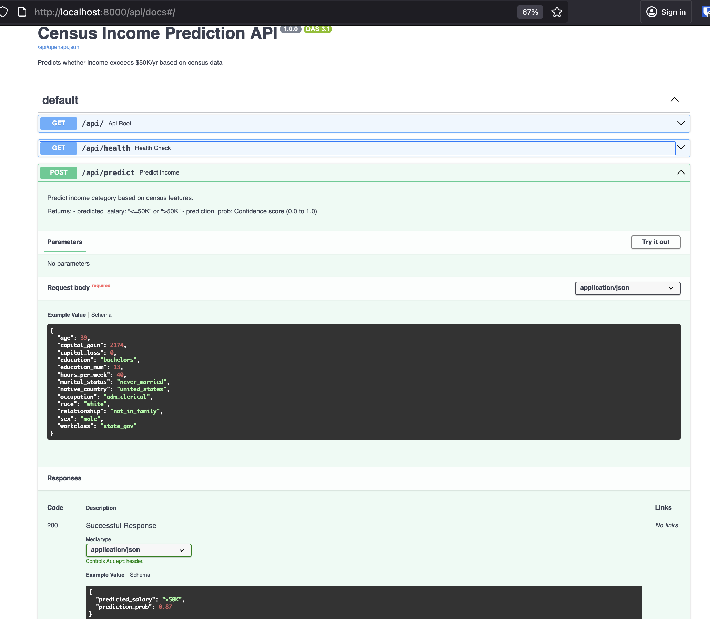
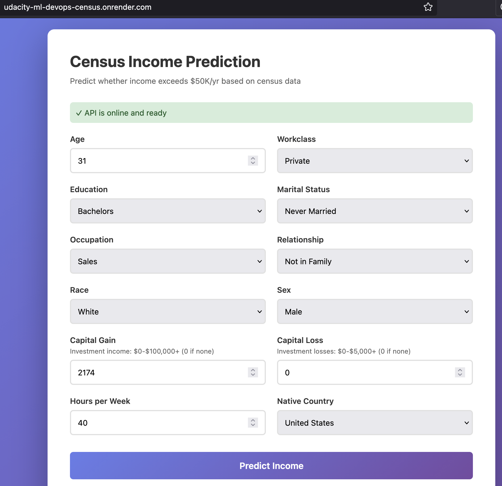
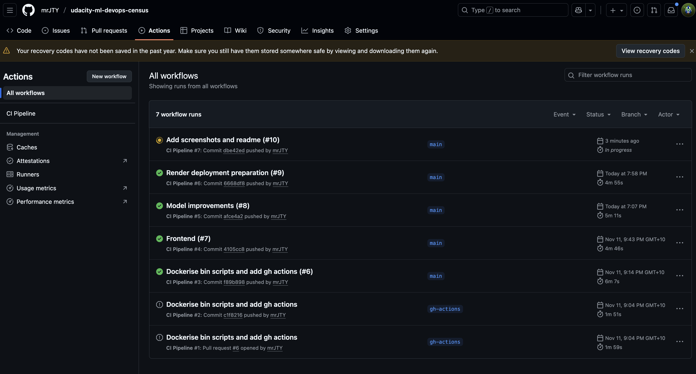
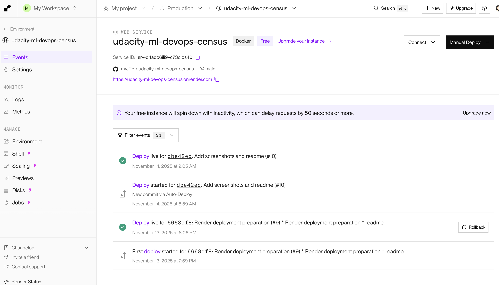

# Census Income Prediction

A machine learning web application that predicts whether a person's income exceeds $50K/year based on census data.

# LINKS
* Github repo: https://github.com/mrJTY/udacity-ml-devops-census
* Interactive front end, deployed to render: https://udacity-ml-devops-census.onrender.com/

## Quick Start
### 1. Clone & Navigate

```bash
git clone <repo-url>
cd udacity-ml-devops-census
```

### 2. Train the Model

```bash
./bin/train_model.sh
```

This trains a Random Forest model with artifacts saved in `model/` for simplicity of deployment.
Using a model registry could be an improvement.

### 3. Start the Application

```bash
./bin/start_api.sh
```

### 4. Access the App

Open your browser:
- **Web App**: http://localhost:8000
- **API Docs**: http://localhost:8000/api/docs

## Usage

### Web Interface

1. Visit http://localhost:8000
2. Fill in the census information form
3. Click "Predict Income"
4. See the prediction and confidence score

### API call example

```bash
curl -X POST http://localhost:8000/api/predict \
  -H "Content-Type: application/json" \
  -d '{
    "age": 39,
    "workclass": "state_gov",
    "education": "bachelors",
    "education_num": 13,
    "marital_status": "never_married",
    "occupation": "adm_clerical",
    "relationship": "not_in_family",
    "race": "white",
    "sex": "male",
    "capital_gain": 2174,
    "capital_loss": 0,
    "hours_per_week": 40,
    "native_country": "united_states"
  }'
```

Response:
```json
{
  "predicted_salary": "<=50K",
  "prediction_prob": 0.85
}
```

## Running Tests

```bash
./bin/run_tests.sh
```

Runs pytest with all tests covering API endpoints, predictions, and validation.

## Bias analysis
A bias analysis can also be run using:
```bash
./bin/analyze_bias.sh
```

## API Endpoints

| Endpoint | Method | Description |
|----------|--------|-------------|
| `/` | GET | Web application |
| `/api/health` | GET | Health check |
| `/api/predict` | POST | Income prediction |
| `/api/docs` | GET | Interactive API docs |

# Screenshots

## API docs

http://localhost:8000/api/docs#/



## Interactive web app frontend

https://udacity-ml-devops-census.onrender.com/



## Continous integrations

### Github actions:


### Deployment on Render.com:


## Post request through a Python script
